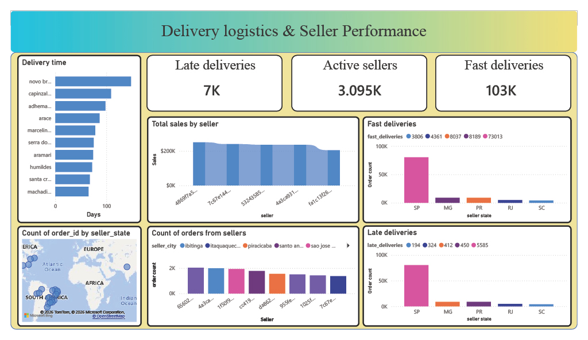
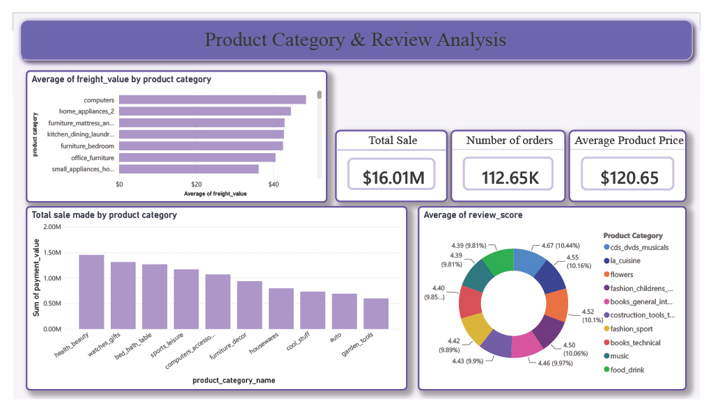
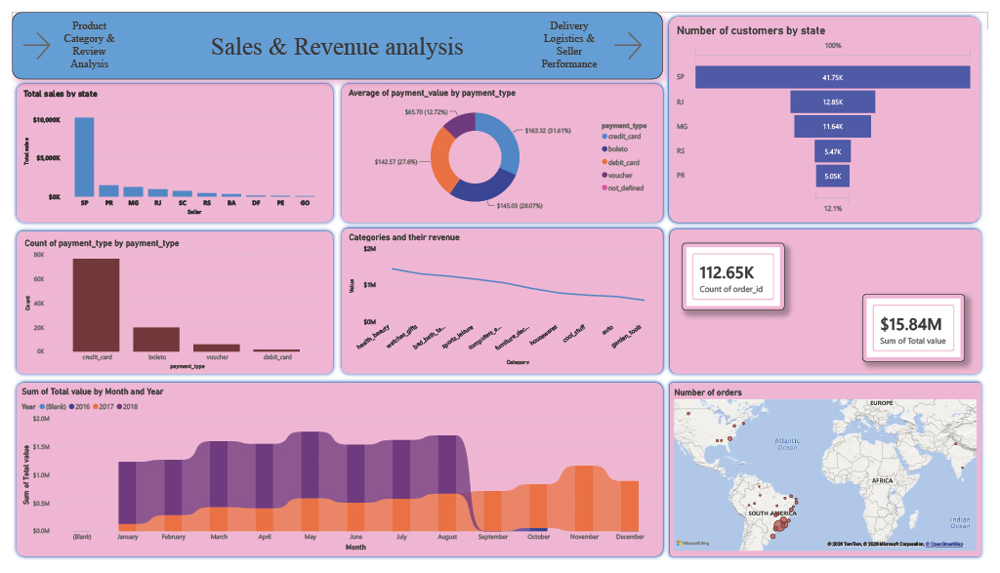

# Brazilian E-Commerce Data Analysis Project


# Overview

This project analyzes the Brazilian Olist E-Commerce dataset using Python, MySQL, and Power BI. The objective is to transform raw uncleaned data into actionable business insights through data profiling, cleaning, database integration, SQL analytics, and interactive dashboards.

## Objectives

- Profile and clean raw datasets.
- Build a relational database.
- Perform exploratory data analysis (EDA).
- Answer business questions using SQL.
- Build an executive Power BI dashboard.
- Generate insights on sales, customers, sellers, products, logistics, and reviews.

---

# Repository Structure

```text
.
├── data profiling.ipynb
├── appending file to DB.ipynb
├── analysis.ipynb
├── postfile_2.sql
├── DASHBOARD 01.pbix
└── README.md
```

## Notebook 1 – data profiling.ipynb

Purpose:
- Load raw datasets.
- Inspect schema and quality.
- Handle missing values.
- Detect duplicates.
- Convert data types.
- Standardize columns.
- Prepare data for storage and analysis.

Typical operations include:
- Importing pandas, numpy and PyMySQL.
- Reading CSV files.
- Using info(), describe(), head(), isnull(), duplicated().
- Cleaning inconsistent values.
- Preparing a consistent analytical dataset.

Business value:
Reliable analytics begin with high-quality data. This notebook ensures downstream SQL and Power BI analyses are based on standardized datasets.

---

## Notebook 2 – appending files

Purpose:
- Establish a PyMySQL database connection.
- Upload cleaned DataFrames into MySQL.
- Create tables.
- Automate loading.

Key workflow:
1. Create database engine.
2. Connect to PostgreSQL.
3. Iterate through cleaned datasets.
4. Load tables using DataFrame.to_sql().
5. Verify successful insertion.

Business value:
Creates a reusable analytical database that supports SQL queries and Power BI.

---

## Notebook 3 – analysis.ipynb

Purpose:
Perform exploratory data analysis.

Typical analyses include:
- Revenue trends
- Orders
- Customers
- Sellers
- Product categories
- Freight
- Delivery performance
- Customer reviews
- Visualizations using Matplotlib and Seaborn

Business value:
Transforms transactional data into business intelligence before dashboard creation.

---

# SQL Analysis

The SQL workbook answers business questions using:
- INNER JOIN
- LEFT JOIN
- GROUP BY
- ORDER BY
- Aggregate functions
- Date functions
- CASE expressions (where applicable)

Representative business questions:
- Total revenue
- Average order value
- Top sellers
- Best-performing product categories
- Customer distribution
- Delivery delays
- Review score analysis
- Freight cost trends

Each query aggregates transactional data into decision-ready metrics.

---

# Power BI Dashboard

The Power BI report provides interactive business intelligence.

## Seller Performance and Delivery Logistics :
1. Found a proper figure on count of late and on time deliveries 
2. Sighted the seller id who makes the most sales
3. extracted information on what category takes more time to get delivered


## Product Category and Review Analysis:
1. Differentiated the products on their freight value
2. Analysed the sale made by different categories
3. Examined the average scores for each category


## Sales and Revenue Analysis
1. Analysed the number of customers by state
2. Found the most commonly used payment methods
3. Found the sale made through different payment methods
 

---

# Technology Stack

- VS Code
- Python
- Pandas
- NumPy
- PyMySQL
- MySQL
- Power BI
- Matplotlib
- Seaborn


---

# Workflow

Raw CSV Files

↓

Data Profiling

↓

Data Cleaning

↓

Database Loading

↓

SQL Analysis

↓

Exploratory Data Analysis

↓

Power BI Dashboard

↓

Business Insights

---

# Key Business Insights

The project enables analysis of:

- Sales performance
- Customer purchasing behavior
- Seller performance
- Product demand
- Logistics efficiency
- Freight costs
- Delivery delays
- Customer satisfaction

---

## Insights

1. Most of the sellers are assisted to provide credit card feature in order to let customers pay
2. Sao Paulo had more number of customers, so the sellers are supposed to concentrate more in the area
3. Sao Paulo had more fast and late deliveries at the same time, so the sellers are supposed to concentrate more in delivery logistics
4. The city Novo Brazil is taking more days too deliver, which needs a significant improvement in delivery logistics
5. Sirjii, iomere, sao patricio are the cities where the delivery performance was fantastic
6. Health and Beauty is the top category on bringing up high sales
7. Since computers and hardware components are delivered with outmost security and safety it's requiring more freight value
8. The average highest reviews are recorded in the entertainment category which is around 4.67

---

# Installation

```bash
git clone <repository-url>

pip install pandas numpy matplotlib seaborn sqlalchemy psycopg2
```

Configure PostgreSQL connection details inside the notebooks before execution.

Run notebooks in this order:

1. data profiling.ipynb
2. appending file to DB.ipynb
3. analysis.ipynb

Open `DASHBOARD 01.pbix` using Power BI Desktop.

---

# Future Enhancements

- Predictive sales forecasting
- Recommendation engine
- Automated ETL pipeline
- Cloud deployment

---

# Author

Puli Abhinav

B.Tech – Computer Science & Engineering (Data Science)

Vaagdevi Engineering College

puliabhinav3@gmail.com
